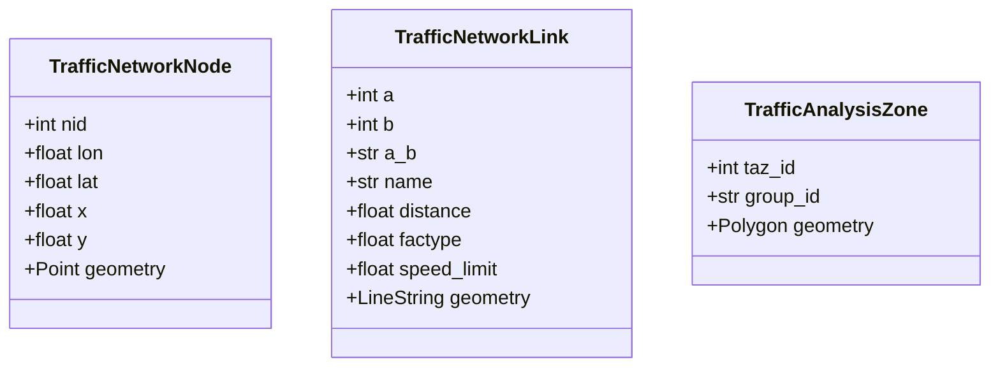
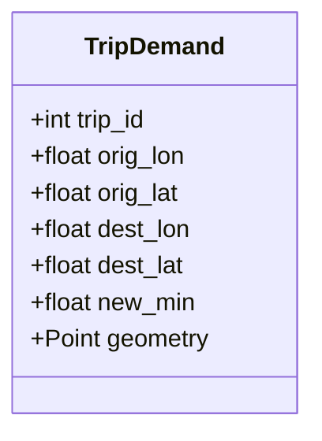
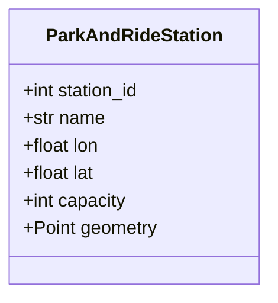

# CarpoolSim: A simulation framework to find carpool trips given Single Occupancy Trips

## The data classes for *traffic network* is as follows

Three datasets or shapefiles are necessary to represent a traffic network:
- TrafficNetworkNode
- TrafficNetworkLink
- TrafficAnalysisZone



Another dataset is necessary to define the trip demands by providing the following minimal required set of information.



The geometry field of "TripDemand" corresponds to the origin of the trip.  Finally, some parking lots can be identified
and represented to consider park and ride carpool.



By default, all geometry fields are using "EPSG:4326" (WGS84) projection as inputs.

## The structure of the project is shown as follows.

```
.
├── carpoolsim  # contains Python code (called by Jupyter Notebooks)
│   ├── basic_settings.py  # IMPORTANT: set up basic information of the project (modify based on your need)
│   ├── carpool  # the core pipeline of running the carpool "simulation"
│   │   ├── __init__.py
│   │   ├── trip_cluster.py
│   │   └── trip_cluster_with_time.py
│   ├── carpool_solver   # the core algorithm (i.e., bipartite) to solve the problem
│   │   ├── __init__.py
│   │   └── bipartite_solver.py
│   ├── database  # code to prepare and interact with the database (e.g., SQLite)
│   │   ├── __init__.py
│   │   ├── prepare_database.py
│   │   └── query_database.py
│   ├── dataclass  # an interface of all data objects to standardize input data
│   │   ├── __init__.py
│   │   ├── parking_lots.py
│   │   ├── traffic_network.py
│   │   └── travel_demands.py
│   ├── network_prepare.py
│   ├── prepare_input.py
│   └── visualization  # visualization tool for plotting results
│       ├── __init__.py
│       ├── carpool_viz.py
│       └── carpool_viz_seq.py
├── data_inputs  # all input data (example of the notebooks)
│   ├── ABM2020 203K
│   │   ├── 2020 links  # traffic network link file
│   │   ├── 2020 nodes with latlon  # traffic network node file
│   │   └── taz  # traffic analysis zone
│   ├── Park_and_Ride_locations  # a shapefile/csv of parking lots
│   ├── gt_survey  # trip demands (survey data in this case)
│   └── cleaned  # cleaned dataset (for all intermediate results before runnig simulation)
├── data_outputs  # store the outputs (and intermediate results)
└── notebooks # all Jupyter notebooks to run the program
```
You can move those files to "data_inputs" folder. 
The files within the "data_inputs" folder are just an example of our own project.
You can set up any folder structure, but remember to reset the paths parameters in *basic_settings.py*.

Require inputs 
1. Three network files:
   1. traffic networks shapefile: a shapefile of traffic links 
   2. traffic nodes shapefile: a shapefile of traffic nodes 
   3. taz: traffic analysis zone that splits a metropolitan region to many small parts
2. One file for PNR stations of Park-and-ride mode:
   1. Park_and_Ride_locations: Parking lots that can be used for Park and Ride trip
3. One file for traffic demand:
   1. gt_survey: a survey of **trip demands** providing origin, destination, depart time, etc.


## Using notebooks for running the tool
Four Jupyter notebooks are provided to run the package. Users are obligated to modify those notebooks to align
with their own analysis purpose. The code talks by itself in those notebooks.
- step0_prepare_data_inputs.ipynb
- step1_prepare_path_retention_database.ipynb
- step2_prepare_traffic_demands.ipynb
- step3_run_carpoolsim.ipynb

